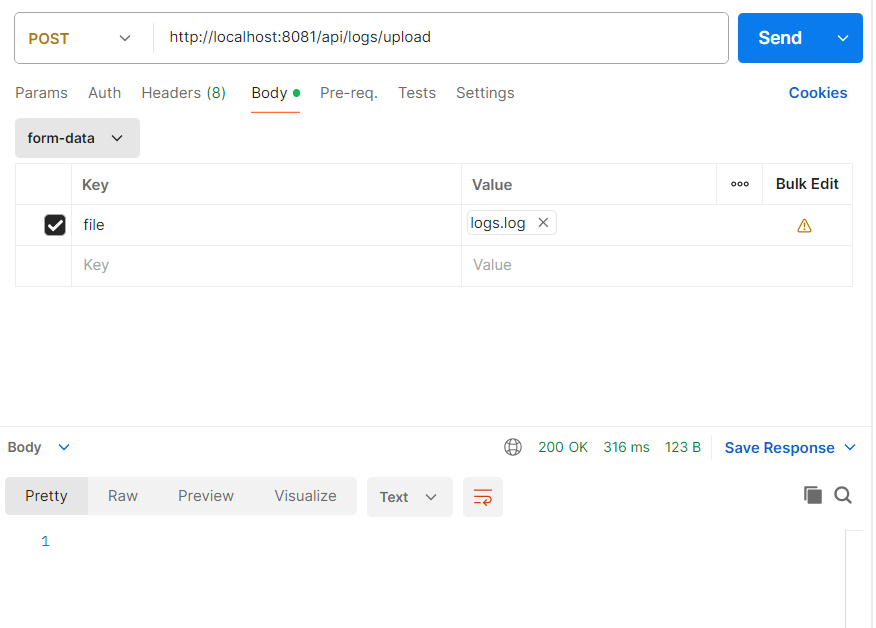
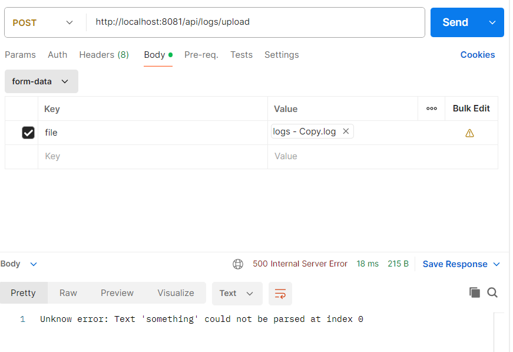

# Read Me First
This is a log monitoring application that reads a file, calculates how long each job takes from start to finish, 
and generates warnings or errors if the processing time exceeds predefined thresholds.

# Getting Started

### Implementation
To implement this application was made the next steps:

* Creating a POST REST endpoint which request the log file
* A service was implemented to analyze the file:
    * Reads the file line by line.
    * Converts each line into a `Log` object.
    * When a job with status `END` is found, the corresponding job with status `START` is searched.
    * For each `START` - `END` job pair, the duration is calculated in minutes.
    * If the job takes more than **10 minutes**, an **ERROR** log is generated.
    * If the job takes more than **5 minutes**, a **WARN** log is generated.
* Exception handling was also implemented.

### Log Object Structure
The `Log` object contains the following fields:
* `time`:  a timestamp in the format HH:MM:SS (hours, minutes, seconds).
* `description`: description of the job.
* `processStatus`: an enum which can have value `START` or `END`.
* `pid`: a unique identifier associated with each job

### Log Output
The WARN and ERROR logs are saved in output file. For that was created a **logback-spring.xml**
where was specified what level of logs to be written in the file, WARN in our case, and how the logs to look like.
The output file is cleaned everytime when the application starts. To continue displaying logs in the console, 
it was needed to specify in the XML the level and format for the console part.

### Testing
In addition to the main logic, it was written unit tests for service class and integration tests for the controller.

# How to run the application
The application is built with **Java 17**, **Spring Boot 3.5.0** and **Maven**.

The server port is set to **8081** in **application.properties**.

The endpoint used is: 
<pre>
POST /api/logs/upload
</pre>

Also, provide a log file containing job records. If no error appears, it will be generated an `OK` response and in the console can be found
ERROR and WARN logs.

If something can't be processing, it will be generated a suggestive response.

The output file can be found here: *logs/output.log*

